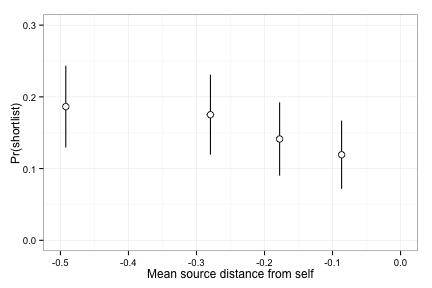

OpenIDEO: Distance of Immediate Inspirations from Self --> Shortlist
========================================================

## Preliminaries

```r
# data
path = "/Users/joelc/Dropbox/Research/dissertation/OpenIDEO/Pipeline/openideo-data-processing-pipeline/data-collection/ConceptLevel_AfterDistanceAndControlsAndSelfDistance_Level1-1.csv"
data.dist.self = read.csv(path)
data.dist.self = subset(data.dist.self, data.dist.self$insp_dist_count > 0)  # subset it

# libraries
library(lme4)
```

```
## Loading required package: lattice
## Loading required package: Matrix
```

```r
library(ggplot2)
```

```
## 
## Attaching package: 'ggplot2'
## 
## The following object is masked from 'package:lme4':
## 
##     fortify
```

```r
library(psych)
```

```
## 
## Attaching package: 'psych'
## 
## The following object is masked from 'package:ggplot2':
## 
##     %+%
```

```r
library(dplyr)
```

```
## 
## Attaching package: 'dplyr'
## 
## The following objects are masked from 'package:stats':
## 
##     filter, lag
## 
## The following objects are masked from 'package:base':
## 
##     intersect, setdiff, setequal, union
```


## Descriptives

```r
ggplot(data.dist.self, aes(insp_distSelf_mean)) + geom_histogram(fill = NA, 
    color = "black") + labs(x = "Mean distance from self", y = "Frequency") + 
    theme_bw()
```

```
## stat_bin: binwidth defaulted to range/30. Use 'binwidth = x' to adjust this.
```

 


```r
ggplot(data.dist.self, aes(insp_distSelf_max)) + geom_histogram(fill = NA, color = "black") + 
    labs(x = "Max distance from self", y = "Frequency") + theme_bw()
```

```
## stat_bin: binwidth defaulted to range/30. Use 'binwidth = x' to adjust this.
```

 


stats

```r
describe(data.dist.self[c("shortlist", "comments_preshortlist", "num_shortlisted_sources", 
    "insp_dist_z_insp_mean", "insp_dist_z_insp_max", "insp_distSelf_mean", "insp_distSelf_max")])
```

```
##                         var   n  mean   sd median trimmed  mad   min   max
## shortlist                 1 707  0.16 0.36   0.00    0.07 0.00  0.00  1.00
## comments_preshortlist     2 707  8.43 9.45   6.00    6.69 5.93  0.00 67.00
## num_shortlisted_sources   3 707  0.51 0.96   0.00    0.30 0.00  0.00 11.00
## insp_dist_z_insp_mean     4 707 -0.10 0.78   0.01   -0.04 0.72 -3.85  1.67
## insp_dist_z_insp_max      5 707  0.45 0.85   0.76    0.58 0.45 -3.85  1.90
## insp_distSelf_mean        6 707 -0.26 0.17  -0.22   -0.24 0.15 -0.93 -0.01
## insp_distSelf_max         7 707 -0.18 0.18  -0.11   -0.14 0.11 -0.93 -0.01
##                         range  skew kurtosis   se
## shortlist                1.00  1.90     1.60 0.01
## comments_preshortlist   67.00  2.45     8.36 0.36
## num_shortlisted_sources 11.00  3.53    23.53 0.04
## insp_dist_z_insp_mean    5.52 -0.96     1.40 0.03
## insp_dist_z_insp_max     5.75 -1.63     2.71 0.03
## insp_distSelf_mean       0.92 -1.10     1.19 0.01
## insp_distSelf_max        0.92 -1.61     2.37 0.01
```


intercorrelations

```r
library(Hmisc)  # note: 'describe' from the psych package won't work past this point
```

```
## Loading required package: grid
## Loading required package: survival
## Loading required package: splines
## Loading required package: Formula
## 
## Attaching package: 'Hmisc'
## 
## The following objects are masked from 'package:dplyr':
## 
##     src, summarize
## 
## The following object is masked from 'package:psych':
## 
##     describe
## 
## The following objects are masked from 'package:base':
## 
##     format.pval, round.POSIXt, trunc.POSIXt, units
```

```r
rcorr(as.matrix(data.dist.self[c("shortlist", "comments_preshortlist", "num_shortlisted_sources", 
    "insp_dist_z_insp_mean", "insp_dist_z_insp_max", "insp_distSelf_mean", "insp_distSelf_max")]))
```

```
##                         shortlist comments_preshortlist
## shortlist                    1.00                  0.33
## comments_preshortlist        0.33                  1.00
## num_shortlisted_sources      0.11                  0.12
## insp_dist_z_insp_mean       -0.10                  0.02
## insp_dist_z_insp_max        -0.05                  0.07
## insp_distSelf_mean          -0.06                 -0.01
## insp_distSelf_max           -0.04                  0.05
##                         num_shortlisted_sources insp_dist_z_insp_mean
## shortlist                                  0.11                 -0.10
## comments_preshortlist                      0.12                  0.02
## num_shortlisted_sources                    1.00                 -0.05
## insp_dist_z_insp_mean                     -0.05                  1.00
## insp_dist_z_insp_max                       0.05                  0.77
## insp_distSelf_mean                         0.11                  0.13
## insp_distSelf_max                          0.13                  0.10
##                         insp_dist_z_insp_max insp_distSelf_mean
## shortlist                              -0.05              -0.06
## comments_preshortlist                   0.07              -0.01
## num_shortlisted_sources                 0.05               0.11
## insp_dist_z_insp_mean                   0.77               0.13
## insp_dist_z_insp_max                    1.00               0.17
## insp_distSelf_mean                      0.17               1.00
## insp_distSelf_max                       0.37               0.86
##                         insp_distSelf_max
## shortlist                           -0.04
## comments_preshortlist                0.05
## num_shortlisted_sources              0.13
## insp_dist_z_insp_mean                0.10
## insp_dist_z_insp_max                 0.37
## insp_distSelf_mean                   0.86
## insp_distSelf_max                    1.00
## 
## n= 707 
## 
## 
## P
##                         shortlist comments_preshortlist
## shortlist                         0.0000               
## comments_preshortlist   0.0000                         
## num_shortlisted_sources 0.0039    0.0010               
## insp_dist_z_insp_mean   0.0107    0.6813               
## insp_dist_z_insp_max    0.1607    0.0618               
## insp_distSelf_mean      0.0909    0.8557               
## insp_distSelf_max       0.2522    0.1859               
##                         num_shortlisted_sources insp_dist_z_insp_mean
## shortlist               0.0039                  0.0107               
## comments_preshortlist   0.0010                  0.6813               
## num_shortlisted_sources                         0.1851               
## insp_dist_z_insp_mean   0.1851                                       
## insp_dist_z_insp_max    0.2014                  0.0000               
## insp_distSelf_mean      0.0032                  0.0005               
## insp_distSelf_max       0.0004                  0.0055               
##                         insp_dist_z_insp_max insp_distSelf_mean
## shortlist               0.1607               0.0909            
## comments_preshortlist   0.0618               0.8557            
## num_shortlisted_sources 0.2014               0.0032            
## insp_dist_z_insp_mean   0.0000               0.0005            
## insp_dist_z_insp_max                         0.0000            
## insp_distSelf_mean      0.0000                                 
## insp_distSelf_max       0.0000               0.0000            
##                         insp_distSelf_max
## shortlist               0.2522           
## comments_preshortlist   0.1859           
## num_shortlisted_sources 0.0004           
## insp_dist_z_insp_mean   0.0055           
## insp_dist_z_insp_max    0.0000           
## insp_distSelf_mean      0.0000           
## insp_distSelf_max
```


plot binnned Pr(shortlist) vs mean self-distance to guide model-building

```r

# make the cuts
data.dist.self$bin_distSelfMean_4 <- cut2(data.dist.self$insp_distSelf_mean, 
    g = 4)

# summarize the data for the bins
summarized_mean <- data.dist.self %.% group_by(bin_distSelfMean_4) %.% summarise(propShortlist = mean(shortlist), 
    meanVal = mean(insp_distSelf_mean), sdVal = sd(insp_distSelf_mean), n = length(shortlist)) %.% 
    mutate(error_propShortlist = sqrt(propShortlist * (1 - propShortlist)/n), 
        error_meanVal = sdVal/sqrt(n))

# plot it!
ggplot(summarized_mean) + geom_errorbar(mapping = aes(x = meanVal, ymin = propShortlist - 
    1.95 * error_propShortlist, ymax = propShortlist + 1.95 * error_propShortlist), 
    width = 0) + geom_errorbarh(aes(x = meanVal, y = propShortlist, xmin = meanVal - 
    1.95 * error_meanVal, xmax = meanVal + 1.95 * error_meanVal), height = 0) + 
    geom_point(mapping = aes(x = meanVal, y = propShortlist), size = 3, shape = 21, 
        fill = "white") + labs(x = "Mean source distance from self", y = "Pr(shortlist)") + 
    scale_x_continuous(breaks = seq(-0.5, 0, 0.1), limits = c(-0.5, 0)) + scale_y_continuous(breaks = seq(0, 
    0.3, 0.1), limits = c(0, 0.3)) + theme_bw()
```

```
## Warning: Removed 4 rows containing missing values (geom_path).
```

 


plot binnned Pr(shortlist) vs max self-distance to guide model-building

```r
# make the cuts
data.dist.self$bin_distSelfMax_4 <- cut2(data.dist.self$insp_distSelf_max, g = 4)

# summarize the data for the bins
summarized_max <- data.dist.self %.% group_by(bin_distSelfMax_4) %.% summarise(propShortlist = mean(shortlist), 
    meanVal = mean(insp_distSelf_max), sdVal = sd(insp_distSelf_max), n = length(shortlist)) %.% 
    mutate(error_propShortlist = sqrt(propShortlist * (1 - propShortlist)/n), 
        error_meanVal = sdVal/sqrt(n))

# plot it!
ggplot(summarized_max) + geom_errorbar(mapping = aes(x = meanVal, ymin = propShortlist - 
    1.95 * error_propShortlist, ymax = propShortlist + 1.95 * error_propShortlist), 
    width = 0) + geom_errorbarh(aes(x = meanVal, y = propShortlist, xmin = meanVal - 
    1.95 * error_meanVal, xmax = meanVal + 1.95 * error_meanVal), height = 0) + 
    geom_point(mapping = aes(x = meanVal, y = propShortlist), size = 3, shape = 21, 
        fill = "white") + labs(x = "Max source distance from self", y = "Pr(shortlist)") + 
    scale_x_continuous(breaks = seq(-0.5, 0, 0.1), limits = c(-0.5, 0)) + scale_y_continuous(breaks = seq(0, 
    0.3, 0.1), limits = c(0, 0.3)) + theme_bw()
```

 


```r
print(summarized_mean)
```

```
## Source: local data frame [4 x 7]
## 
##   bin_distSelfMean_4 propShortlist meanVal   sdVal   n error_propShortlist
## 1   [-0.929,-0.3484)        0.1864 -0.4921 0.12690 177             0.02927
## 2   [-0.348,-0.2173)        0.1751 -0.2795 0.03932 177             0.02857
## 3   [-0.217,-0.1347)        0.1412 -0.1778 0.02418 177             0.02618
## 4   [-0.135,-0.0131]        0.1193 -0.0867 0.03351 176             0.02443
## Variables not shown: error_meanVal (dbl)
```

```r
print(summarized_max)
```

```
## Source: local data frame [4 x 7]
## 
##    bin_distSelfMax_4 propShortlist  meanVal   sdVal   n
## 1 [-0.9292,-0.24403)        0.1638 -0.43349 0.15855 177
## 2 [-0.2440,-0.10529)        0.1921 -0.16696 0.04070 177
## 3 [-0.1053,-0.04348)        0.1469 -0.07359 0.01898 177
## 4 [-0.0435,-0.00589]        0.1193 -0.02828 0.00962 176
## Variables not shown: error_propShortlist (dbl), error_meanVal (dbl)
```


So it looks like there's a general downward trend but it's really noisy. Maybe some hint of nonlinearity for max, but I think it's hard to tell. There *might* be a negative slope with acceleration for max distance, but I doubt that will really capture the data well, given the noise. We'll see.

# MODEL TIME!

Let's make new variables to model with

```r
data.dist.self = mutate(data.dist.self, num_shortlisted_sources_gmcent = num_shortlisted_sources - 
    mean(num_shortlisted_sources), comments_preshortlist_gmcent = comments_preshortlist - 
    mean(comments_preshortlist), insp_dist_z_insp_mean_gmcent = insp_dist_z_insp_mean - 
    mean(insp_dist_z_insp_mean), insp_distSelf_mean_gmcent = insp_distSelf_mean - 
    mean(insp_distSelf_mean), insp_distSelf_mean_gmcent_sq = insp_distSelf_mean_gmcent^2, 
    insp_distSelf_max_gmcent = insp_distSelf_max - mean(insp_distSelf_max), 
    insp_distSelf_max_gmcent_sq = insp_distSelf_max_gmcent^2)
```


## Fully unconditional and controls

We don't have to show them here because we know them from the previous analysis. We're just running them here so we can do LRTs.
NOTE THAT ALL MODELS HENCEFORTH ARE GRAND-MEAN CENTERED!!!


```r
fit.distSelf.insp.null = glmer(shortlist ~ (1 | authorURL) + (1 | challenge), 
    data = data.dist.self, family = binomial)
fit.distSelf.insp.controls = glmer(shortlist ~ (1 | authorURL) + (1 | challenge) + 
    num_shortlisted_sources_gmcent + comments_preshortlist_gmcent, data = data.dist.self, 
    family = binomial)
```


## Mean Distance from Self

```r
fit.distSelf.insp.distSelf_FE = glmer(shortlist ~ (1 | authorURL) + (1 | challenge) + 
    num_shortlisted_sources_gmcent + comments_preshortlist_gmcent + insp_distSelf_mean_gmcent, 
    data = data.dist.self, family = binomial)
summary(fit.distSelf.insp.distSelf_FE)
```

```
## Generalized linear mixed model fit by maximum likelihood ['glmerMod']
##  Family: binomial ( logit )
## Formula: shortlist ~ (1 | authorURL) + (1 | challenge) + num_shortlisted_sources_gmcent +      comments_preshortlist_gmcent + insp_distSelf_mean_gmcent 
##    Data: data.dist.self 
## 
##      AIC      BIC   logLik deviance 
##    520.6    547.9   -254.3    508.6 
## 
## Random effects:
##  Groups    Name        Variance Std.Dev.
##  authorURL (Intercept) 0.285    0.534   
##  challenge (Intercept) 0.749    0.866   
## Number of obs: 707, groups: authorURL, 357; challenge, 12
## 
## Fixed effects:
##                                Estimate Std. Error z value Pr(>|z|)    
## (Intercept)                     -1.8072     0.2846   -6.35  2.2e-10 ***
## num_shortlisted_sources_gmcent   0.1618     0.1151    1.41    0.160    
## comments_preshortlist_gmcent     0.0947     0.0121    7.81  5.8e-15 ***
## insp_distSelf_mean_gmcent       -1.2920     0.7527   -1.72    0.086 .  
## ---
## Signif. codes:  0 '***' 0.001 '**' 0.01 '*' 0.05 '.' 0.1 ' ' 1
## 
## Correlation of Fixed Effects:
##             (Intr) nm_s__ cmmn__
## nm_shrtls__ -0.030              
## cmmnts_prs_ -0.119 -0.074       
## insp_dstS__  0.073 -0.122 -0.031
```

```r
confint.merMod(fit.distSelf.insp.distSelf_FE, method = "Wald")
```

```
##                                   2.5 %  97.5 %
## (Intercept)                    -2.36509 -1.2493
## num_shortlisted_sources_gmcent -0.06377  0.3873
## comments_preshortlist_gmcent    0.07096  0.1185
## insp_distSelf_mean_gmcent      -2.76712  0.1832
```

```r
anova(fit.distSelf.insp.controls, fit.distSelf.insp.distSelf_FE, test = "LRT")  # add anything over control?
```

```
## Data: data.dist.self
## Models:
## fit.distSelf.insp.controls: shortlist ~ (1 | authorURL) + (1 | challenge) + num_shortlisted_sources_gmcent + 
## fit.distSelf.insp.controls:     comments_preshortlist_gmcent
## fit.distSelf.insp.distSelf_FE: shortlist ~ (1 | authorURL) + (1 | challenge) + num_shortlisted_sources_gmcent + 
## fit.distSelf.insp.distSelf_FE:     comments_preshortlist_gmcent + insp_distSelf_mean_gmcent
##                               Df AIC BIC logLik deviance Chisq Chi Df
## fit.distSelf.insp.controls     5 521 544   -256      511             
## fit.distSelf.insp.distSelf_FE  6 521 548   -254      509  2.81      1
##                               Pr(>Chisq)  
## fit.distSelf.insp.controls                
## fit.distSelf.insp.distSelf_FE      0.094 .
## ---
## Signif. codes:  0 '***' 0.001 '**' 0.01 '*' 0.05 '.' 0.1 ' ' 1
```


Interesting! This sort of makes sense. Mean distance from self is slightly positively correlated with mean distance from the problem (r = .13, *p* < .001). So one way to interpret this is as a residual from the cb-anchored effect. That one seems like where the real action is. If we include cb-distance in the model, I think it all goes away, even though they're not collinear.


```r
fit.distSelf.insp.distselfCB_FE = glmer(shortlist ~ (1 | authorURL) + (1 | challenge) + 
    num_shortlisted_sources_gmcent + comments_preshortlist_gmcent + insp_distSelf_mean_gmcent + 
    insp_dist_z_insp_mean_gmcent, data = data.dist.self, family = binomial)
summary(fit.distSelf.insp.distselfCB_FE)
```

```
## Generalized linear mixed model fit by maximum likelihood ['glmerMod']
##  Family: binomial ( logit )
## Formula: shortlist ~ (1 | authorURL) + (1 | challenge) + num_shortlisted_sources_gmcent +      comments_preshortlist_gmcent + insp_distSelf_mean_gmcent +      insp_dist_z_insp_mean_gmcent 
##    Data: data.dist.self 
## 
##      AIC      BIC   logLik deviance 
##    517.5    549.5   -251.8    503.5 
## 
## Random effects:
##  Groups    Name        Variance Std.Dev.
##  authorURL (Intercept) 0.305    0.552   
##  challenge (Intercept) 0.732    0.856   
## Number of obs: 707, groups: authorURL, 357; challenge, 12
## 
## Fixed effects:
##                                Estimate Std. Error z value Pr(>|z|)    
## (Intercept)                     -1.8356     0.2835   -6.48  9.4e-11 ***
## num_shortlisted_sources_gmcent   0.1419     0.1152    1.23    0.218    
## comments_preshortlist_gmcent     0.0964     0.0122    7.87  3.5e-15 ***
## insp_distSelf_mean_gmcent       -1.0063     0.7834   -1.28    0.199    
## insp_dist_z_insp_mean_gmcent    -0.3612     0.1586   -2.28    0.023 *  
## ---
## Signif. codes:  0 '***' 0.001 '**' 0.01 '*' 0.05 '.' 0.1 ' ' 1
## 
## Correlation of Fixed Effects:
##             (Intr) nm_s__ cmmn__ in_S__
## nm_shrtls__ -0.024                     
## cmmnts_prs_ -0.128 -0.080              
## insp_dstS__  0.056 -0.121 -0.004       
## insp_ds____  0.073  0.077 -0.112 -0.182
```

```r
confint.merMod(fit.distSelf.insp.distselfCB_FE, method = "Wald")
```

```
##                                   2.5 %   97.5 %
## (Intercept)                    -2.39112 -1.28000
## num_shortlisted_sources_gmcent -0.08387  0.36771
## comments_preshortlist_gmcent    0.07239  0.12039
## insp_distSelf_mean_gmcent      -2.54171  0.52913
## insp_dist_z_insp_mean_gmcent   -0.67208 -0.05022
```


Ok, it doesn't go away entirely, but it's muted a little (SE doesn't change that much - still very wide CI). It fits better than controls only, but not better than cb-distance only.


```r
anova(fit.distSelf.insp.controls, fit.distSelf.insp.distselfCB_FE)
```

```
## Data: data.dist.self
## Models:
## fit.distSelf.insp.controls: shortlist ~ (1 | authorURL) + (1 | challenge) + num_shortlisted_sources_gmcent + 
## fit.distSelf.insp.controls:     comments_preshortlist_gmcent
## fit.distSelf.insp.distselfCB_FE: shortlist ~ (1 | authorURL) + (1 | challenge) + num_shortlisted_sources_gmcent + 
## fit.distSelf.insp.distselfCB_FE:     comments_preshortlist_gmcent + insp_distSelf_mean_gmcent + 
## fit.distSelf.insp.distselfCB_FE:     insp_dist_z_insp_mean_gmcent
##                                 Df AIC BIC logLik deviance Chisq Chi Df
## fit.distSelf.insp.controls       5 521 544   -256      511             
## fit.distSelf.insp.distselfCB_FE  7 518 549   -252      504  7.84      2
##                                 Pr(>Chisq)  
## fit.distSelf.insp.controls                  
## fit.distSelf.insp.distselfCB_FE       0.02 *
## ---
## Signif. codes:  0 '***' 0.001 '**' 0.01 '*' 0.05 '.' 0.1 ' ' 1
```

```r
fit.dist.insp.distMean_FE = glmer(shortlist ~ (1 | authorURL) + (1 | challenge) + 
    num_shortlisted_sources_gmcent + comments_preshortlist_gmcent + insp_dist_z_insp_mean_gmcent, 
    data = data.dist.self, family = binomial)
anova(fit.dist.insp.distMean_FE, fit.distSelf.insp.distselfCB_FE)
```

```
## Data: data.dist.self
## Models:
## fit.dist.insp.distMean_FE: shortlist ~ (1 | authorURL) + (1 | challenge) + num_shortlisted_sources_gmcent + 
## fit.dist.insp.distMean_FE:     comments_preshortlist_gmcent + insp_dist_z_insp_mean_gmcent
## fit.distSelf.insp.distselfCB_FE: shortlist ~ (1 | authorURL) + (1 | challenge) + num_shortlisted_sources_gmcent + 
## fit.distSelf.insp.distselfCB_FE:     comments_preshortlist_gmcent + insp_distSelf_mean_gmcent + 
## fit.distSelf.insp.distselfCB_FE:     insp_dist_z_insp_mean_gmcent
##                                 Df AIC BIC logLik deviance Chisq Chi Df
## fit.dist.insp.distMean_FE        6 517 544   -253      505             
## fit.distSelf.insp.distselfCB_FE  7 518 549   -252      504  1.58      1
##                                 Pr(>Chisq)
## fit.dist.insp.distMean_FE                 
## fit.distSelf.insp.distselfCB_FE       0.21
```


So I think the model with cb-distance is our best estimate of any effects of distance from self: we'll plot that then.

```r
xFake = seq(-.5,0,.05)
yhat = 1/(1+exp(-(fixef(fit.distSelf.insp.distselfCB_FE)[1] + 
                    fixef(fit.distSelf.insp.distselfCB_FE)[4]*xFake))) 
fitted = data.frame(xFake,yhat)

ggplot(summarized_mean) + 
  geom_errorbar(mapping=aes(x=meanVal, ymin=propShortlist-1.95* error_propShortlist, ymax=propShortlist+1.95* error_propShortlist),width=0.0) + 
  geom_errorbarh(aes(x=meanVal,y=propShortlist,xmin=meanVal-1.95*error_meanVal, xmax=meanVal+1.95* error_meanVal),height=0.0) + 
  geom_point(mapping=aes(x=meanVal,y=propShortlist), size=3, shape=21, fill="white") + 
  geom_line(data=fitted,aes(x=xFake,y=yhat)) + #fitted line
  labs(x="Mean source distance from self",y="Pr(shortlist)") + 
  scale_x_continuous(breaks=seq(-0.5,0,.1),limits=c(-0.5,0)) + 
  scale_y_continuous(breaks=seq(0,.3,.1),limits=c(0,.3)) + 
  theme_bw()
```

```
## Warning: Removed 4 rows containing missing values (geom_path).
```

 


Very quickly, we establish that there isn't (detectable) problem variation

```r
fit.distSelf.insp.distselfCB_RE.chall = glmer(shortlist ~ (1 | authorURL) + 
    (insp_distSelf_mean_gmcent | challenge) + num_shortlisted_sources_gmcent + 
    comments_preshortlist_gmcent + insp_distSelf_mean_gmcent + insp_dist_z_insp_mean_gmcent, 
    data = data.dist.self, family = binomial)
anova(fit.distSelf.insp.distselfCB_FE, fit.distSelf.insp.distselfCB_RE.chall, 
    test = "LRT")
```

```
## Data: data.dist.self
## Models:
## fit.distSelf.insp.distselfCB_FE: shortlist ~ (1 | authorURL) + (1 | challenge) + num_shortlisted_sources_gmcent + 
## fit.distSelf.insp.distselfCB_FE:     comments_preshortlist_gmcent + insp_distSelf_mean_gmcent + 
## fit.distSelf.insp.distselfCB_FE:     insp_dist_z_insp_mean_gmcent
## fit.distSelf.insp.distselfCB_RE.chall: shortlist ~ (1 | authorURL) + (insp_distSelf_mean_gmcent | challenge) + 
## fit.distSelf.insp.distselfCB_RE.chall:     num_shortlisted_sources_gmcent + comments_preshortlist_gmcent + 
## fit.distSelf.insp.distselfCB_RE.chall:     insp_distSelf_mean_gmcent + insp_dist_z_insp_mean_gmcent
##                                       Df AIC BIC logLik deviance Chisq
## fit.distSelf.insp.distselfCB_FE        7 518 549   -252      504      
## fit.distSelf.insp.distselfCB_RE.chall  9 520 561   -251      502  1.18
##                                       Chi Df Pr(>Chisq)
## fit.distSelf.insp.distselfCB_FE                        
## fit.distSelf.insp.distselfCB_RE.chall      2       0.56
```

```r
fit.distSelf.insp.distselfCB_RE.auth = glmer(shortlist ~ (insp_distSelf_mean | 
    authorURL) + (1 | challenge) + num_shortlisted_sources_gmcent + comments_preshortlist_gmcent + 
    insp_distSelf_mean_gmcent + insp_dist_z_insp_mean_gmcent, data = data.dist.self, 
    family = binomial)
anova(fit.distSelf.insp.distselfCB_FE, fit.distSelf.insp.distselfCB_RE.auth, 
    test = "LRT")
```

```
## Data: data.dist.self
## Models:
## fit.distSelf.insp.distselfCB_FE: shortlist ~ (1 | authorURL) + (1 | challenge) + num_shortlisted_sources_gmcent + 
## fit.distSelf.insp.distselfCB_FE:     comments_preshortlist_gmcent + insp_distSelf_mean_gmcent + 
## fit.distSelf.insp.distselfCB_FE:     insp_dist_z_insp_mean_gmcent
## fit.distSelf.insp.distselfCB_RE.auth: shortlist ~ (insp_distSelf_mean | authorURL) + (1 | challenge) + 
## fit.distSelf.insp.distselfCB_RE.auth:     num_shortlisted_sources_gmcent + comments_preshortlist_gmcent + 
## fit.distSelf.insp.distselfCB_RE.auth:     insp_distSelf_mean_gmcent + insp_dist_z_insp_mean_gmcent
##                                      Df AIC BIC logLik deviance Chisq
## fit.distSelf.insp.distselfCB_FE       7 518 549   -252      504      
## fit.distSelf.insp.distselfCB_RE.auth  9 520 561   -251      502  1.37
##                                      Chi Df Pr(>Chisq)
## fit.distSelf.insp.distselfCB_FE                       
## fit.distSelf.insp.distselfCB_RE.auth      2        0.5
```


Also very quickly, test the idea that we might have a negative (and accelerating) slope, which is *very* slightly hinted at in the data, and also makes conceptual sense (if most of my ideas are *very* far from me, I'm cooked)

```r
fit.distSelf.insp.distselfsqCB_FE = glmer(shortlist ~ (1 | authorURL) + (1 | 
    challenge) + num_shortlisted_sources_gmcent + comments_preshortlist_gmcent + 
    insp_distSelf_mean_gmcent + insp_distSelf_mean_gmcent_sq + insp_dist_z_insp_mean_gmcent, 
    data = data.dist.self, family = binomial)
summary(fit.distSelf.insp.distselfsqCB_FE)
```

```
## Generalized linear mixed model fit by maximum likelihood ['glmerMod']
##  Family: binomial ( logit )
## Formula: shortlist ~ (1 | authorURL) + (1 | challenge) + num_shortlisted_sources_gmcent +      comments_preshortlist_gmcent + insp_distSelf_mean_gmcent +      insp_distSelf_mean_gmcent_sq + insp_dist_z_insp_mean_gmcent 
##    Data: data.dist.self 
## 
##      AIC      BIC   logLik deviance 
##    519.5    556.0   -251.8    503.5 
## 
## Random effects:
##  Groups    Name        Variance Std.Dev.
##  authorURL (Intercept) 0.300    0.548   
##  challenge (Intercept) 0.733    0.856   
## Number of obs: 707, groups: authorURL, 357; challenge, 12
## 
## Fixed effects:
##                                Estimate Std. Error z value Pr(>|z|)    
## (Intercept)                     -1.8234     0.2937   -6.21  5.3e-10 ***
## num_shortlisted_sources_gmcent   0.1422     0.1152    1.23    0.217    
## comments_preshortlist_gmcent     0.0962     0.0123    7.85  4.2e-15 ***
## insp_distSelf_mean_gmcent       -1.1050     1.0472   -1.06    0.291    
## insp_distSelf_mean_gmcent_sq    -0.4445     3.0843   -0.14    0.885    
## insp_dist_z_insp_mean_gmcent    -0.3605     0.1587   -2.27    0.023 *  
## ---
## Signif. codes:  0 '***' 0.001 '**' 0.01 '*' 0.05 '.' 0.1 ' ' 1
## 
## Correlation of Fixed Effects:
##             (Intr) nm_s__ cmmn__ in_S__ i_S___
## nm_shrtls__ -0.015                            
## cmmnts_prs_ -0.138 -0.081                     
## insp_dstS__ -0.131 -0.110  0.034              
## insp_dsS___ -0.260 -0.029  0.057  0.659       
## insp_ds____  0.074  0.077 -0.113 -0.147 -0.014
```


## Max Distance from Self

Now let's quickly see what's going on with max distance. I don't expect anything out of this, other than to show that staying really close doesn't seem to hurt you.

```r
fit.distSelf.insp.distSelfMaxCB_FE = glmer(shortlist ~ (1 | authorURL) + (1 | 
    challenge) + num_shortlisted_sources_gmcent + comments_preshortlist_gmcent + 
    insp_distSelf_max_gmcent + insp_dist_z_insp_mean_gmcent, data = data.dist.self, 
    family = binomial)
summary(fit.distSelf.insp.distSelfMaxCB_FE)
```

```
## Generalized linear mixed model fit by maximum likelihood ['glmerMod']
##  Family: binomial ( logit )
## Formula: shortlist ~ (1 | authorURL) + (1 | challenge) + num_shortlisted_sources_gmcent +      comments_preshortlist_gmcent + insp_distSelf_max_gmcent +      insp_dist_z_insp_mean_gmcent 
##    Data: data.dist.self 
## 
##      AIC      BIC   logLik deviance 
##    516.9    548.8   -251.5    502.9 
## 
## Random effects:
##  Groups    Name        Variance Std.Dev.
##  authorURL (Intercept) 0.296    0.544   
##  challenge (Intercept) 0.737    0.858   
## Number of obs: 707, groups: authorURL, 357; challenge, 12
## 
## Fixed effects:
##                                Estimate Std. Error z value Pr(>|z|)    
## (Intercept)                     -1.8323     0.2839   -6.45  1.1e-10 ***
## num_shortlisted_sources_gmcent   0.1458     0.1154    1.26    0.207    
## comments_preshortlist_gmcent     0.0975     0.0123    7.93  2.1e-15 ***
## insp_distSelf_max_gmcent        -1.0486     0.6818   -1.54    0.124    
## insp_dist_z_insp_mean_gmcent    -0.3567     0.1567   -2.28    0.023 *  
## ---
## Signif. codes:  0 '***' 0.001 '**' 0.01 '*' 0.05 '.' 0.1 ' ' 1
## 
## Correlation of Fixed Effects:
##             (Intr) nm_s__ cmmn__ in_S__
## nm_shrtls__ -0.024                     
## cmmnts_prs_ -0.130 -0.071              
## insp_dstS__  0.049 -0.127 -0.072       
## insp_ds____  0.074  0.078 -0.102 -0.165
```

```r
confint.merMod(fit.distSelf.insp.distSelfMaxCB_FE, method = "Wald")
```

```
##                                   2.5 %   97.5 %
## (Intercept)                    -2.38864 -1.27591
## num_shortlisted_sources_gmcent -0.08049  0.37204
## comments_preshortlist_gmcent    0.07342  0.12160
## insp_distSelf_max_gmcent       -2.38487  0.28759
## insp_dist_z_insp_mean_gmcent   -0.66387 -0.04944
```

```r
anova(fit.dist.insp.distMean_FE, fit.distSelf.insp.distSelfMaxCB_FE)
```

```
## Data: data.dist.self
## Models:
## fit.dist.insp.distMean_FE: shortlist ~ (1 | authorURL) + (1 | challenge) + num_shortlisted_sources_gmcent + 
## fit.dist.insp.distMean_FE:     comments_preshortlist_gmcent + insp_dist_z_insp_mean_gmcent
## fit.distSelf.insp.distSelfMaxCB_FE: shortlist ~ (1 | authorURL) + (1 | challenge) + num_shortlisted_sources_gmcent + 
## fit.distSelf.insp.distSelfMaxCB_FE:     comments_preshortlist_gmcent + insp_distSelf_max_gmcent + 
## fit.distSelf.insp.distSelfMaxCB_FE:     insp_dist_z_insp_mean_gmcent
##                                    Df AIC BIC logLik deviance Chisq Chi Df
## fit.dist.insp.distMean_FE           6 517 544   -253      505             
## fit.distSelf.insp.distSelfMaxCB_FE  7 517 549   -252      503  2.21      1
##                                    Pr(>Chisq)
## fit.dist.insp.distMean_FE                    
## fit.distSelf.insp.distSelfMaxCB_FE       0.14
```


Similar negative slope estimated with considerable uncertainty. Let's quickly check if a quadratic fits better

```r
data.dist.self$insp_distSelf_max_sq = data.dist.self$insp_distSelf_max^2
fit.distSelf.insp.distSelfMaxSqCB_FE = glmer(shortlist ~ (1 | authorURL) + (1 | 
    challenge) + num_shortlisted_sources_gmcent + comments_preshortlist_gmcent + 
    insp_distSelf_max_gmcent + insp_distSelf_max_gmcent_sq + insp_dist_z_insp_mean_gmcent, 
    data = data.dist.self, family = binomial)
summary(fit.distSelf.insp.distSelfMaxSqCB_FE)
```

```
## Generalized linear mixed model fit by maximum likelihood ['glmerMod']
##  Family: binomial ( logit )
## Formula: shortlist ~ (1 | authorURL) + (1 | challenge) + num_shortlisted_sources_gmcent +      comments_preshortlist_gmcent + insp_distSelf_max_gmcent +      insp_distSelf_max_gmcent_sq + insp_dist_z_insp_mean_gmcent 
##    Data: data.dist.self 
## 
##      AIC      BIC   logLik deviance 
##    517.5    553.9   -250.7    501.5 
## 
## Random effects:
##  Groups    Name        Variance Std.Dev.
##  authorURL (Intercept) 0.235    0.485   
##  challenge (Intercept) 0.742    0.861   
## Number of obs: 707, groups: authorURL, 357; challenge, 12
## 
## Fixed effects:
##                                Estimate Std. Error z value Pr(>|z|)    
## (Intercept)                     -1.7146     0.2946   -5.82  5.9e-09 ***
## num_shortlisted_sources_gmcent   0.1539     0.1152    1.34    0.181    
## comments_preshortlist_gmcent     0.0977     0.0123    7.96  1.7e-15 ***
## insp_distSelf_max_gmcent        -2.1890     1.1522   -1.90    0.057 .  
## insp_distSelf_max_gmcent_sq     -3.6174     2.9860   -1.21    0.226    
## insp_dist_z_insp_mean_gmcent    -0.3367     0.1562   -2.16    0.031 *  
## ---
## Signif. codes:  0 '***' 0.001 '**' 0.01 '*' 0.05 '.' 0.1 ' ' 1
## 
## Correlation of Fixed Effects:
##             (Intr) nm_s__ cmmn__ in_S__ i_S___
## nm_shrtls__ -0.004                            
## cmmnts_prs_ -0.104 -0.062                     
## insp_dstS__ -0.181 -0.138 -0.114              
## insp_dsS___ -0.268 -0.075 -0.081  0.788       
## insp_ds____  0.086  0.083 -0.091 -0.156 -0.056
```

```r
confint.merMod(fit.distSelf.insp.distSelfMaxSqCB_FE, method = "Wald")
```

```
##                                   2.5 %   97.5 %
## (Intercept)                    -2.29193 -1.13728
## num_shortlisted_sources_gmcent -0.07178  0.37961
## comments_preshortlist_gmcent    0.07367  0.12178
## insp_distSelf_max_gmcent       -4.44723  0.06916
## insp_distSelf_max_gmcent_sq    -9.46984  2.23503
## insp_dist_z_insp_mean_gmcent   -0.64285 -0.03057
```

```r
anova(fit.dist.insp.distMean_FE, fit.distSelf.insp.distSelfMaxSqCB_FE)
```

```
## Data: data.dist.self
## Models:
## fit.dist.insp.distMean_FE: shortlist ~ (1 | authorURL) + (1 | challenge) + num_shortlisted_sources_gmcent + 
## fit.dist.insp.distMean_FE:     comments_preshortlist_gmcent + insp_dist_z_insp_mean_gmcent
## fit.distSelf.insp.distSelfMaxSqCB_FE: shortlist ~ (1 | authorURL) + (1 | challenge) + num_shortlisted_sources_gmcent + 
## fit.distSelf.insp.distSelfMaxSqCB_FE:     comments_preshortlist_gmcent + insp_distSelf_max_gmcent + 
## fit.distSelf.insp.distSelfMaxSqCB_FE:     insp_distSelf_max_gmcent_sq + insp_dist_z_insp_mean_gmcent
##                                      Df AIC BIC logLik deviance Chisq
## fit.dist.insp.distMean_FE             6 517 544   -253      505      
## fit.distSelf.insp.distSelfMaxSqCB_FE  8 517 554   -251      501  3.68
##                                      Chi Df Pr(>Chisq)
## fit.dist.insp.distMean_FE                             
## fit.distSelf.insp.distSelfMaxSqCB_FE      2       0.16
```


Nope. If we were fully Bayesian we might say we just don't have enough data! Even if we're not fully Bayesian I think that's a reasonable supposition!
Let's plot it and be done with this then!

```r
xFake = seq(-.5,0,.05)
yhat = 1/(1+exp(-(fixef(fit.distSelf.insp.distSelfMaxCB_FE)[1] + 
                    fixef(fit.distSelf.insp.distSelfMaxCB_FE)[4]*xFake
                  )))
fitted_max = data.frame(xFake,yhat)

ggplot(summarized_max) + 
  geom_errorbar(mapping=aes(x=meanVal, ymin=propShortlist-1.95* error_propShortlist, ymax=propShortlist+1.95* error_propShortlist),width=0.0) + 
  geom_errorbarh(aes(x=meanVal,y=propShortlist,xmin=meanVal-1.95*error_meanVal, xmax=meanVal+1.95* error_meanVal),height=0.0) + 
  geom_point(mapping=aes(x=meanVal,y=propShortlist), size=3, shape=21, fill="white") + 
  geom_line(data=fitted_max,aes(x=xFake,y=yhat)) + #fitted line
  labs(x="Max source distance from self",y="Pr(shortlist)") + 
  scale_x_continuous(breaks=seq(-0.5,0,.1),limits=c(-0.5,0)) + 
  scale_y_continuous(breaks=seq(0,.3,.1),limits=c(0,.3)) + 
  theme_bw()
```

 

