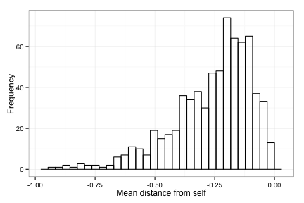
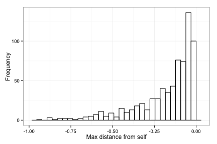
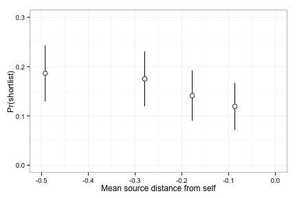

OpenIDEO: Diversity of Immediate Inspirations --> Shortlist
========================================================


```r
library(lme4)
```

```
## Loading required package: lattice
## Loading required package: Matrix
```

```r
library(arm)
```

```
## Loading required package: MASS
## 
## arm (Version 1.6-10, built: 2013-11-15)
## 
## Working directory is /Users/joelc/Dropbox/Research/dissertation/OpenIDEO/Pipeline/openideo-data-processing-pipeline/analyses
```

```r
library(ggplot2)
```

```
## 
## Attaching package: 'ggplot2'
## 
## The following object is masked from 'package:lme4':
## 
##     fortify
```

```r
library(psych)
```

```
## 
## Attaching package: 'psych'
## 
## The following object is masked from 'package:ggplot2':
## 
##     %+%
## 
## The following objects are masked from 'package:arm':
## 
##     logit, rescale, sim
```

```r
library(dplyr)
```

```
## 
## Attaching package: 'dplyr'
## 
## The following object is masked from 'package:MASS':
## 
##     select
## 
## The following objects are masked from 'package:stats':
## 
##     filter, lag
## 
## The following objects are masked from 'package:base':
## 
##     intersect, setdiff, setequal, union
```

```r

# load the data
path = "/Users/joelc/Dropbox/Research/dissertation/OpenIDEO/Pipeline/Challenge_and_High-level_Data/iPython intermediate inputs and outputs/ConceptLevel_AfterDistanceAndControlsAndDiversity.csv"
data = read.csv(path, header = TRUE, sep = ",")
data <- subset(data, insp_dist_count > 1)  # drop the single-insp and no-insp cases
```


# Descriptives

stats

```r
describe(data[c("shortlist", "comments_preshortlist", "num_shortlisted_sources", 
    "insp_dist_z_insp_mean", "insp_div_mean")])
```

```
##                         var   n  mean   sd median trimmed  mad   min   max
## shortlist                 1 456  0.16 0.37   0.00    0.07 0.00  0.00  1.00
## comments_preshortlist     2 456  9.14 9.92   6.00    7.28 5.93  0.00 67.00
## num_shortlisted_sources   3 456  0.61 1.07   0.00    0.39 0.00  0.00 11.00
## insp_dist_z_insp_mean     4 456 -0.13 0.62  -0.04   -0.08 0.51 -2.66  1.32
## insp_div_mean             5 456 -0.20 0.12  -0.17   -0.19 0.09 -0.89 -0.02
##                         range  skew kurtosis   se
## shortlist                1.00  1.87     1.50 0.02
## comments_preshortlist   67.00  2.33     7.16 0.46
## num_shortlisted_sources 11.00  3.47    22.02 0.05
## insp_dist_z_insp_mean    3.98 -1.01     1.80 0.03
## insp_div_mean            0.87 -1.60     3.68 0.01
```


intercorrelations

```r
library(Hmisc)  # note: 'describe' from the psych package won't work past this point
```

```
## Loading required package: grid
## Loading required package: survival
## Loading required package: splines
## Loading required package: Formula
## 
## Attaching package: 'Hmisc'
## 
## The following objects are masked from 'package:dplyr':
## 
##     src, summarize
## 
## The following object is masked from 'package:psych':
## 
##     describe
## 
## The following objects are masked from 'package:base':
## 
##     format.pval, round.POSIXt, trunc.POSIXt, units
```

```r
rcorr(as.matrix(data[c("shortlist", "comments_preshortlist", "num_shortlisted_sources", 
    "insp_dist_z_insp_mean", "insp_div_mean")]))
```

```
##                         shortlist comments_preshortlist
## shortlist                    1.00                  0.36
## comments_preshortlist        0.36                  1.00
## num_shortlisted_sources      0.16                  0.11
## insp_dist_z_insp_mean       -0.11                 -0.01
## insp_div_mean               -0.01                  0.05
##                         num_shortlisted_sources insp_dist_z_insp_mean
## shortlist                                  0.16                 -0.11
## comments_preshortlist                      0.11                 -0.01
## num_shortlisted_sources                    1.00                  0.02
## insp_dist_z_insp_mean                      0.02                  1.00
## insp_div_mean                              0.10                  0.29
##                         insp_div_mean
## shortlist                       -0.01
## comments_preshortlist            0.05
## num_shortlisted_sources          0.10
## insp_dist_z_insp_mean            0.29
## insp_div_mean                    1.00
## 
## n= 456 
## 
## 
## P
##                         shortlist comments_preshortlist
## shortlist                         0.0000               
## comments_preshortlist   0.0000                         
## num_shortlisted_sources 0.0006    0.0172               
## insp_dist_z_insp_mean   0.0162    0.8012               
## insp_div_mean           0.7914    0.3088               
##                         num_shortlisted_sources insp_dist_z_insp_mean
## shortlist               0.0006                  0.0162               
## comments_preshortlist   0.0172                  0.8012               
## num_shortlisted_sources                         0.6031               
## insp_dist_z_insp_mean   0.6031                                       
## insp_div_mean           0.0346                  0.0000               
##                         insp_div_mean
## shortlist               0.7914       
## comments_preshortlist   0.3088       
## num_shortlisted_sources 0.0346       
## insp_dist_z_insp_mean   0.0000       
## insp_div_mean
```


plot distribution of diversity

```r
ggplot(data, aes(insp_div_mean)) + geom_histogram(fill = NA, color = "black") + 
    theme_bw()
```

```
## stat_bin: binwidth defaulted to range/30. Use 'binwidth = x' to adjust this.
```

 


scatterplot matrix

```r
pairs(~shortlist + comments_preshortlist + num_shortlisted_sources + insp_dist_z_insp_mean + 
    insp_div_mean, data = data, panel = function(x, y) {
    points(x, y)
    abline(lm(y ~ x), lty = 2)
    lines(lowess(x, y))
}, diag.panel = function(x) {
    par(new = T)
    hist(x, main = "", axes = F)
})
```

 


plot binnned Pr(shortlist) vs mean diversity to guide model-building

```r
data$bin_divMean_4 <- cut2(data$insp_div_mean, g = 4)

# summarize the data for the bins
summarized <- data %.% group_by(bin_divMean_4) %.% summarise(propShortlist = mean(shortlist), 
    meanVal = mean(insp_div_mean), sdVal = sd(insp_div_mean), n = length(shortlist))

# compute standard errors
summarized$error_propShortlist <- sqrt(summarized$propShortlist * (1 - summarized$propShortlist)/summarized$n)
summarized$error_meanVal <- summarized$sdVal/sqrt(summarized$n)

ggplot(summarized) + geom_errorbar(mapping = aes(x = meanVal, ymin = propShortlist - 
    1.95 * error_propShortlist, ymax = propShortlist + 1.95 * error_propShortlist), 
    width = 0) + geom_errorbarh(aes(x = meanVal, y = propShortlist, xmin = meanVal - 
    1.95 * error_meanVal, xmax = meanVal + 1.95 * error_meanVal), height = 0) + 
    geom_point(mapping = aes(x = meanVal, y = propShortlist), size = 3, shape = 21, 
        fill = "white") + labs(x = "Mean pairwise distance", y = "Pr(shortlist)") + 
    scale_x_continuous(breaks = seq(-0.45, 0, 0.1), limits = c(-0.45, 0)) + 
    scale_y_continuous(breaks = seq(0, 0.3, 0.1), limits = c(0, 0.3)) + theme_bw()
```

 


# MODEL TIME!

## Fully unconditional

the model


```r
fit.div.insp.null = glmer(shortlist ~ (1 | authorURL) + (1 | challenge), data = data, 
    family = binomial)
summary(fit.div.insp.null)
```

```
## Generalized linear mixed model fit by maximum likelihood ['glmerMod']
##  Family: binomial ( logit )
## Formula: shortlist ~ (1 | authorURL) + (1 | challenge) 
##    Data: data 
## 
##      AIC      BIC   logLik deviance 
##    394.3    406.6   -194.1    388.3 
## 
## Random effects:
##  Groups    Name        Variance Std.Dev.
##  authorURL (Intercept) 0.555    0.745   
##  challenge (Intercept) 0.372    0.610   
## Number of obs: 456, groups: authorURL, 239; challenge, 12
## 
## Fixed effects:
##             Estimate Std. Error z value Pr(>|z|)    
## (Intercept)   -1.787      0.237   -7.53    5e-14 ***
## ---
## Signif. codes:  0 '***' 0.001 '**' 0.01 '*' 0.05 '.' 0.1 ' ' 1
```

```r
confint.merMod(fit.div.insp.null, method = "Wald")
```

```
##              2.5 % 97.5 %
## (Intercept) -2.252 -1.322
```


### test sig. of variance components

challenge

```r
fit.div.insp.auth = glmer(shortlist ~ (1 | authorURL), data = data, family = binomial)
anova(fit.div.insp.auth, fit.div.insp.null, test = "LRT")
```

```
## Data: data
## Models:
## fit.div.insp.auth: shortlist ~ (1 | authorURL)
## fit.div.insp.null: shortlist ~ (1 | authorURL) + (1 | challenge)
##                   Df AIC BIC logLik deviance Chisq Chi Df Pr(>Chisq)  
## fit.div.insp.auth  2 397 406   -197      393                          
## fit.div.insp.null  3 394 407   -194      388  5.19      1      0.023 *
## ---
## Signif. codes:  0 '***' 0.001 '**' 0.01 '*' 0.05 '.' 0.1 ' ' 1
```


author

```r
fit.div.insp.chall = glmer(shortlist ~ (1 | challenge), data = data, family = binomial)
anova(fit.div.insp.chall, fit.div.insp.null, test = "LRT")
```

```
## Data: data
## Models:
## fit.div.insp.chall: shortlist ~ (1 | challenge)
## fit.div.insp.null: shortlist ~ (1 | authorURL) + (1 | challenge)
##                    Df AIC BIC logLik deviance Chisq Chi Df Pr(>Chisq)  
## fit.div.insp.chall  2 397 405   -196      393                          
## fit.div.insp.null   3 394 407   -194      388  4.41      1      0.036 *
## ---
## Signif. codes:  0 '***' 0.001 '**' 0.01 '*' 0.05 '.' 0.1 ' ' 1
```


## Controls


```r
fit.div.insp.controls = glmer(shortlist ~ (1 | authorURL) + (1 | challenge) + 
    num_shortlisted_sources + comments_preshortlist, data = data, family = binomial)
summary(fit.div.insp.controls)
```

```
## Generalized linear mixed model fit by maximum likelihood ['glmerMod']
##  Family: binomial ( logit )
## Formula: shortlist ~ (1 | authorURL) + (1 | challenge) + num_shortlisted_sources +      comments_preshortlist 
##    Data: data 
## 
##      AIC      BIC   logLik deviance 
##    337.1    357.7   -163.6    327.1 
## 
## Random effects:
##  Groups    Name        Variance Std.Dev.
##  authorURL (Intercept) 0.502    0.708   
##  challenge (Intercept) 0.796    0.892   
## Number of obs: 456, groups: authorURL, 239; challenge, 12
## 
## Fixed effects:
##                         Estimate Std. Error z value Pr(>|z|)    
## (Intercept)              -2.9912     0.3682   -8.12  4.5e-16 ***
## num_shortlisted_sources   0.2407     0.1379    1.75    0.081 .  
## comments_preshortlist     0.1020     0.0149    6.86  7.1e-12 ***
## ---
## Signif. codes:  0 '***' 0.001 '**' 0.01 '*' 0.05 '.' 0.1 ' ' 1
## 
## Correlation of Fixed Effects:
##             (Intr) nm_sh_
## nm_shrtlst_ -0.244       
## cmmnts_prsh -0.469 -0.044
```

```r
confint.merMod(fit.div.insp.controls, method = "Wald")
```

```
##                            2.5 %  97.5 %
## (Intercept)             -3.71283 -2.2696
## num_shortlisted_sources -0.02961  0.5110
## comments_preshortlist    0.07287  0.1312
```

```r
anova(fit.div.insp.null, fit.div.insp.controls, test = "LRT")  # yes, chisq(2) = 61.14, p < .001
```

```
## Data: data
## Models:
## fit.div.insp.null: shortlist ~ (1 | authorURL) + (1 | challenge)
## fit.div.insp.controls: shortlist ~ (1 | authorURL) + (1 | challenge) + num_shortlisted_sources + 
## fit.div.insp.controls:     comments_preshortlist
##                       Df AIC BIC logLik deviance Chisq Chi Df Pr(>Chisq)
## fit.div.insp.null      3 394 407   -194      388                        
## fit.div.insp.controls  5 337 358   -164      327  61.1      2    5.3e-14
##                          
## fit.div.insp.null        
## fit.div.insp.controls ***
## ---
## Signif. codes:  0 '***' 0.001 '**' 0.01 '*' 0.05 '.' 0.1 ' ' 1
```


## Mean Diversity

```r
data$insp_div_mean_rescaled <- data$insp_div_mean * 10  #rescale for easier interpretation of coefficient
fit.div.insp.divmean = glmer(shortlist ~ (1 | authorURL) + (1 | challenge) + 
    insp_div_mean_rescaled + num_shortlisted_sources + comments_preshortlist, 
    data = data, family = binomial)
summary(fit.div.insp.divmean)
```

```
## Generalized linear mixed model fit by maximum likelihood ['glmerMod']
##  Family: binomial ( logit )
## Formula: shortlist ~ (1 | authorURL) + (1 | challenge) + insp_div_mean_rescaled +      num_shortlisted_sources + comments_preshortlist 
##    Data: data 
## 
##      AIC      BIC   logLik deviance 
##    338.8    363.6   -163.4    326.8 
## 
## Random effects:
##  Groups    Name        Variance Std.Dev.
##  authorURL (Intercept) 0.493    0.702   
##  challenge (Intercept) 0.789    0.888   
## Number of obs: 456, groups: authorURL, 239; challenge, 12
## 
## Fixed effects:
##                         Estimate Std. Error z value Pr(>|z|)    
## (Intercept)              -3.1501     0.4799   -6.56  5.3e-11 ***
## insp_div_mean_rescaled   -0.0727     0.1348   -0.54    0.590    
## num_shortlisted_sources   0.2467     0.1385    1.78    0.075 .  
## comments_preshortlist     0.1021     0.0149    6.86  6.9e-12 ***
## ---
## Signif. codes:  0 '***' 0.001 '**' 0.01 '*' 0.05 '.' 0.1 ' ' 1
## 
## Correlation of Fixed Effects:
##             (Intr) ins___ nm_sh_
## insp_dv_mn_  0.644              
## nm_shrtlst_ -0.243 -0.087       
## cmmnts_prsh -0.382 -0.035 -0.040
```

```r
confint.merMod(fit.div.insp.divmean, method = "Wald")
```

```
##                            2.5 %  97.5 %
## (Intercept)             -4.09077 -2.2094
## insp_div_mean_rescaled  -0.33689  0.1914
## num_shortlisted_sources -0.02482  0.5181
## comments_preshortlist    0.07290  0.1312
```

```r
anova(fit.div.insp.controls, fit.div.insp.divmean, test = "LRT")  # add anything over control?
```

```
## Data: data
## Models:
## fit.div.insp.controls: shortlist ~ (1 | authorURL) + (1 | challenge) + num_shortlisted_sources + 
## fit.div.insp.controls:     comments_preshortlist
## fit.div.insp.divmean: shortlist ~ (1 | authorURL) + (1 | challenge) + insp_div_mean_rescaled + 
## fit.div.insp.divmean:     num_shortlisted_sources + comments_preshortlist
##                       Df AIC BIC logLik deviance Chisq Chi Df Pr(>Chisq)
## fit.div.insp.controls  5 337 358   -164      327                        
## fit.div.insp.divmean   6 339 364   -163      327  0.28      1        0.6
```


# quadratic?
data.div.insp$insp_div_mean_rescaled_sq <- data.div.insp$insp_div_mean^2
fit.div.insp.divmean.quadr = glmer(shortlist ~ (1|authorURL) + (1|challenge) + insp_div_mean_rescaled + insp_div_mean_rescaled_sq + num_shortlisted_sources + comments_preshortlist, data=data.div.insp, family=binomial)
summary(fit.div.insp.divmean.quadr)
confint.merMod(fit.div.insp.divmean.quadr,method='Wald')
anova(fit.div.insp.divmean,fit.div.insp.divmean.quadr,test='LRT')

# any problem variation?
fit.div.insp.divmean.RE = glmer(shortlist ~ (1|authorURL) + (insp_div_mean_rescaled|challenge) + insp_div_mean_rescaled + num_shortlisted_sources + comments_preshortlist, data=data.div.insp, family=binomial)
summary(fit.div.insp.divmean.RE)
confint.merMod(fit.div.insp.divmean.RE,method='Wald')
anova(fit.div.insp.divmean,fit.div.insp.divmean.RE,test='LRT') 

# outlier influence
influence.div.insp.divmean = influence.ME(fit.div.insp.divmean,obs=TRUE) #drop individual cases, not higher-level units
dfbetas.divmean = dfbetas.estex(influence.div.insp.divmean,parameters='insp_div_mean')
boxplot(dfbetas.divmean,ylab="DFBETAS for mean diversity")

### REPEAT DISTANCE ###
# base
fit.div.insp.distmean = glmer(shortlist ~ (1|authorURL) + (1|challenge) + insp_dist_z_insp_mean + num_shortlisted_sources + comments_preshortlist, data=data.div.insp, family=binomial)
summary(fit.div.insp.distmean) # effect is in the same direction, of similar size, but with more noise (now "marginal")
confint.merMod(fit.div.insp.distmean,method='Wald') # 95% CI = [-0.91,0.07]

# add (control for?) diversity
fit.div.insp.distmean.divmean = glmer(shortlist ~ (1|authorURL) + (1|challenge) + insp_dist_z_insp_mean + insp_div_mean_rescaled + num_shortlisted_sources + comments_preshortlist, data=data.div.insp, family=binomial)
summary(fit.div.insp.distmean.divmean)
confint.merMod(fit.div.insp.distmean.divmean,method='Wald')

# not much point, but see if there's an interaction between distance and diversity? (bivariate linear r = ~.3)
data.div.insp$insp_distmeanXdivmean = data.div.insp$insp_dist_z_insp_mean * data.div.insp$insp_div_mean # create interaction term
fit.div.insp.distmean.divmean.inter = glmer(shortlist ~ (1|authorURL) + (1|challenge) + insp_dist_z_insp_mean + insp_div_mean_rescaled + insp_distmeanXdivmean + num_shortlisted_sources + comments_preshortlist, data=data.div.insp, family=binomial)
summary(fit.div.insp.distmean.divmean.inter)
confint.merMod(fit.div.insp.distmean.divmean.inter,method='Wald')

anova(fit.div.insp.controls,fit.div.insp.distmean,fit.div.insp.distmean.divmean, fit.div.insp.distmean.divmean.inter,test='LRT')

### MIN, MAX, SD ###

## min
data.div.insp$insp_div_min_rescaled <- data.div.insp$insp_div_min*10 #rescale for easier interpretation of coefficient
fit.div.insp.divmin = glmer(shortlist ~ (1|authorURL) + (1|challenge) + insp_div_min_rescaled + num_shortlisted_sources + comments_preshortlist, data=data.div.insp, family=binomial)
summary(fit.div.insp.divmin)

# min RE
fit.div.insp.divmin.RE = glmer(shortlist ~ (1|authorURL) + (insp_div_min_rescaled|challenge) + insp_div_min_rescaled + num_shortlisted_sources + comments_preshortlist, data=data.div.insp, family=binomial)
summary(fit.div.insp.divmin.RE)

## max
data.div.insp$insp_div_max_rescaled <- data.div.insp$insp_div_max*10 #rescale for easier interpretation of coefficient
fit.div.insp.divmax = glmer(shortlist ~ (1|authorURL) + (1|challenge) + insp_div_max_rescaled + num_shortlisted_sources + comments_preshortlist, data=data.div.insp, family=binomial)
summary(fit.div.insp.divmax)

# max RE
fit.div.insp.divmax.RE = glmer(shortlist ~ (1|authorURL) + (insp_div_max_rescaled|challenge) + insp_div_max_rescaled + num_shortlisted_sources + comments_preshortlist, data=data.div.insp, family=binomial)
summary(fit.div.insp.divmax.RE)

#########

data.div.insp$dfBETAdivmean <- influence.stats[,2]
ggplot(data.div.insp,aes(x=challenge,y=dfBETAdivmean)) + geom_boxplot() + theme_bw() + theme(axis.text.x = element_text(angle = 90, hjust = 1)) + ylim(-1,1)

# quick check if votes gives us different results
summary(glmer(votes ~ (1|challenge) + (1|authorURL) + insp_dist_z_insp_mean + comments_preshortlist + num_shortlisted_sources, data=data.div.insp,family=poisson))
# not really. but there is a high degree of overdispersion (~16!)
var(data.div.insp$insp_div_mean)/mean(data.div.insp$insp_div_mean)

# get sense of standardized betas
data.div.insp$insp_div_mean_z <- scale(data.div.insp$insp_div_mean,scale=TRUE,center=TRUE)
data.div.insp$feedback_z <- scale(data.div.insp$comments_preshortlist,scale=TRUE,center=TRUE)
data.div.insp$shortSource_z <- scale(data.div.insp$num_shortlisted_sources,scale=TRUE,center=TRUE)
summary(glmer(shortlist ~ (1|challenge) + (1|authorURL) + insp_div_mean_z + feedback_z + shortSource_z, data=data.div.insp, family=binomial))
confint.merMod(glmer(shortlist ~ (1|challenge) + (1|authorURL) + insp_div_mean_z + feedback_z + shortSource_z, data=data.div.insp, family=binomial),method='Wald')
